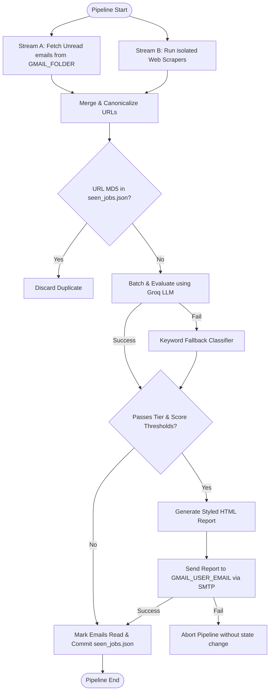

# 💼 Automated AI-Powered Job-Filtering Pipeline

An automated, daily job-hunting pipeline designed for entry-level Python Backend Engineers. The pipeline ingests new jobs from two distinct streams (incoming Gmail alerts and automated web scrapers), filters out duplicate listings using canonicalized URL hashing, evaluates/scores the jobs using a state-of-the-art LLM on Groq, and sends a highly structured daily digest email with the best matches.

It is designed to run locally or as a serverless routine on **GitHub Actions**, committing its deduplication state back to the repository automatically.

---

## 🏗️ Architecture & Processing Flow

The pipeline executes in a strict transactional flow to guarantee no jobs are missed or double-processed. Below is the workflow diagram:



1. **Ingestion**: 
   - **Stream A (Gmail IMAP)**: Authenticates securely, selects **only** the `Daily-Jobs` folder, and pulls body texts and URLs from unread emails.
   - **Stream B (Web Scraping)**: Uses `cloudscraper` and `BeautifulSoup4` to crawl configured career pages in isolated execution blocks (errors do not propagate).
2. **Deduplication**: Extracts application links, strips tracking parameters (`utm_*`, referral IDs, etc.) to form canonical URLs, hashes them via MD5, and filters out duplicates using the persistent `seen_jobs.json` file.
3. **AI Filtering**: Sends new listings in batches to Groq (`llama-3.3-70b-versatile`). It evaluates candidates against entry-level Python Backend criteria. If the API fails or is rate-limited, it falls back to a local, regex-based keyword matcher.
4. **Transactional Delivery**: Renders matches into a responsive, color-coded HTML email and pushes it back to the user via SMTP. On successful delivery, the pipeline marks emails as read and updates the JSON database. If SMTP fails, the state is untouched, and the next run will retry.

---

## 📁 Repository Directory Structure

The repository is organized cleanly as follows:

*   **`main.py`** — The primary pipeline orchestrator. It manages imports, execution flow, error safety nets, and transactional validation.
*   **`config.py`** — Stores config constants (thresholds, targets, folder names) and handles environment variable verification.
*   **`gmail_imap.py`** — Handles IMAP sessions, parses HTML email parts using BeautifulSoup, extracts URLs, and manages Gmail flag updates.
*   **`scraper.py`** — Implements the scraping framework. Contains `cloudscraper` routines and URL scanners for individual target sites.
*   **`dedup.py`** — Functions to canonicalize URLs, compute MD5 hashes, and maintain the `seen_jobs.json` state database.
*   **`ai_filter.py`** — Interacts with the Groq client, structures JSON schemas, prompts the LLM, and houses the backup rule-based classifier.
*   **`models.py`** — Standardized Pydantic data schemas (`JobEvaluation` and `JobEvaluationList`) ensuring correct type parsing from LLM outputs.
*   **`email_report.py`** — Constructs the HTML email digest template and sends it securely to the user via SMTP.
*   **`seen_jobs.json`** — The flat-file JSON database containing hashes of already-processed jobs.
*   **`requirements.txt`** — Package dependencies for the project environment.
*   **`.github/workflows/job_scraper.yml`** — Daily GitHub Actions pipeline configuration.

---

## ⚙️ Configuration & Environment Variables

All critical credentials and configuration options are validated during runtime initialization.

### Required Environment Variables
Create a local `.env` file or export these variables in your terminal:

| Variable | Description | Example |
| :--- | :--- | :--- |
| `GROQ_API_KEY` | API Key for Groq cloud inference. | `gsk_yA71...` |
| `GMAIL_USER_EMAIL` | The Gmail address used to fetch emails and receive reports. | `example@gmail.com` |
| `GMAIL_APP_PASSWORD` | A 16-character App Password generated in Google Account settings. | `abcd efgh ijkl mnop` |

### Key Project Constants (`config.py`)
*   **`GMAIL_FOLDER`** (`"Daily-Jobs"`): The target Gmail folder/label the pipeline is restricted to read.
*   **`GROQ_MODEL`** (`"llama-3.3-70b-versatile"`): The model used for AI evaluations.
*   **`MIN_TIER_B_SCORE`** (`70`): The minimum score required to report a fuzzy (Tier B) match. Tier A matches are forwarded unconditionally.

---

## 🚀 Local Setup & Installation

### 1. Prerequisites
- Python 3.12 or higher.
- A Google account with IMAP enabled.
- A Groq account (free API key available at console.groq.com).

### 2. Google Mail Inbox Setup
1. Log in to your Gmail account.
2. Go to **Settings > See all settings > Forwarding and POP/IMAP** and verify **IMAP is enabled**.
3. Create a custom label named **`Daily-Jobs`**.
4. Configure a filter to automatically route your incoming daily job alerts (e.g., from LinkedIn, Naukri, Internshala) directly to the `Daily-Jobs` folder.
5. Visit [Google Accounts Security](https://myaccount.google.com/security), enable 2-step verification, and generate a new **App Password** for the app. Save this 16-character string.

### 3. Repository Setup
Clone the repository and install the dependencies:
```bash
git clone <your-repo-url>
cd job-tracker
pip install -r requirements.txt
```

### 4. Running the Script
Export your environment variables and execute the orchestrator:
```bash
# Windows (PowerShell)
$env:GROQ_API_KEY="your-groq-key"
$env:GMAIL_USER_EMAIL="your-email@gmail.com"
$env:GMAIL_APP_PASSWORD="your-app-password"
python main.py

# Linux/macOS
export GROQ_API_KEY="your-groq-key"
export GMAIL_USER_EMAIL="your-email@gmail.com"
export GMAIL_APP_PASSWORD="your-app-password"
python main.py
```

---

## 🤖 GitHub Actions Automated Run

To run this pipeline daily without keeping your local machine on, deploy it using the provided GitHub Actions workflow.

1. Push your repository to a private GitHub repository (highly recommended to maintain state privacy).
2. Navigate to your repository on GitHub.
3. Go to **Settings > Secrets and variables > Actions**.
4. Add the following as **Repository Secrets**:
   - `GROQ_API_KEY`
   - `GMAIL_USER_EMAIL`
   - `GMAIL_APP_PASSWORD`
5. The workflow is scheduled via cron to run daily at **15:30 UTC** (9:00 PM IST).
6. You can also trigger it manually at any time by going to the **Actions** tab, selecting **Daily Job Filter**, and clicking **Run workflow**.

---

## 🔒 Security & Data Boundaries

To prevent credentials leak or unwanted access, the codebase implements strict security boundaries:
*   **Restricted IMAP Access**: The pipeline only opens the specific folder defined by `GMAIL_FOLDER` (`Daily-Jobs`). It does not touch your Inbox, Sent Mail, or other folders.
*   **Read-Only Fetching**: Emails are fetched with a `readonly=True` handle. Flags are only toggled to `\Seen` (read) after SMTP reports are safely transmitted.
*   **Self-Contained Emails**: The SMTP engine hard-binds both `From` and `To` email fields to the authenticated user's address. It is structurally impossible to forward job reports to external email addresses.
*   **Zero Hard-Coded Credentials**: No API keys, email addresses, or app passwords are saved in the code. All secrets are loaded directly into transient environment variables.
